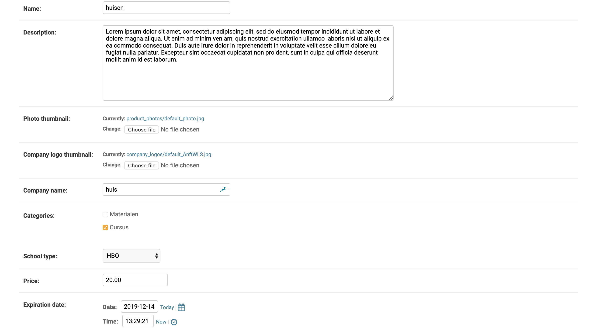
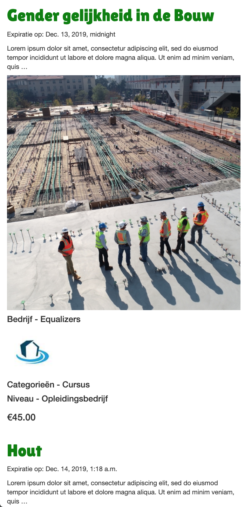

# DjangoConstructionSite
### A Django website, featuring a list of construction courses and materials on offer.

## Each list item has:

- a name
- a photo
- a description (long text. In the list view, abbreviate this to 25 words)
- name of company offering the product
- thumbnail of company logo
- one or more categories, which are editable from the django admin.
- schooltype (just one of: “praktijkonderwijs”, “vmbo”, “mbo”, “hbo” of
“opleidingsbedrijf”)
- price
- expiration date

## The model looks so:



## How the webpage looks:



***

## To run:

I use a virtual environment called `myvenv`, as seen in the home directory.

To run the website locally, run from `djangowim`:
```
$ source myvenv/bin/activate                                         
$ python manage.py makemigrations building_product    
$ python manage.py migrate building_product   
$ python manage.py runserver                    
```
And then go to the development server it points to, and add `/admin` to access the admin login.